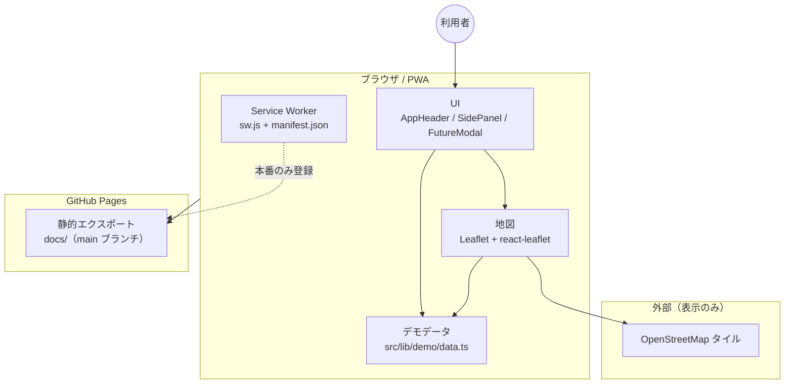
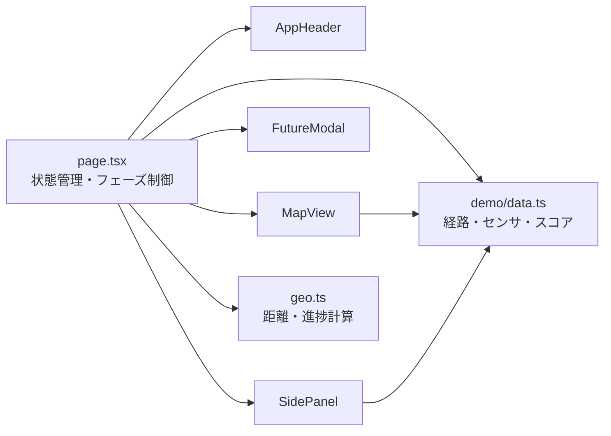
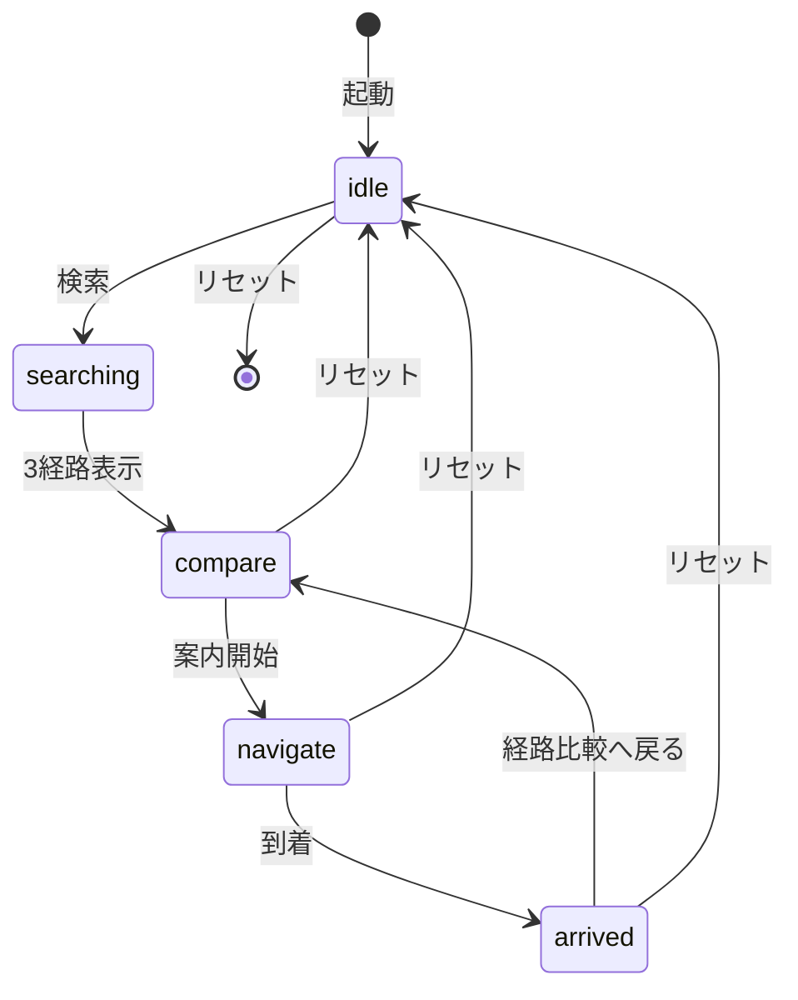
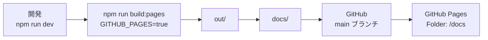
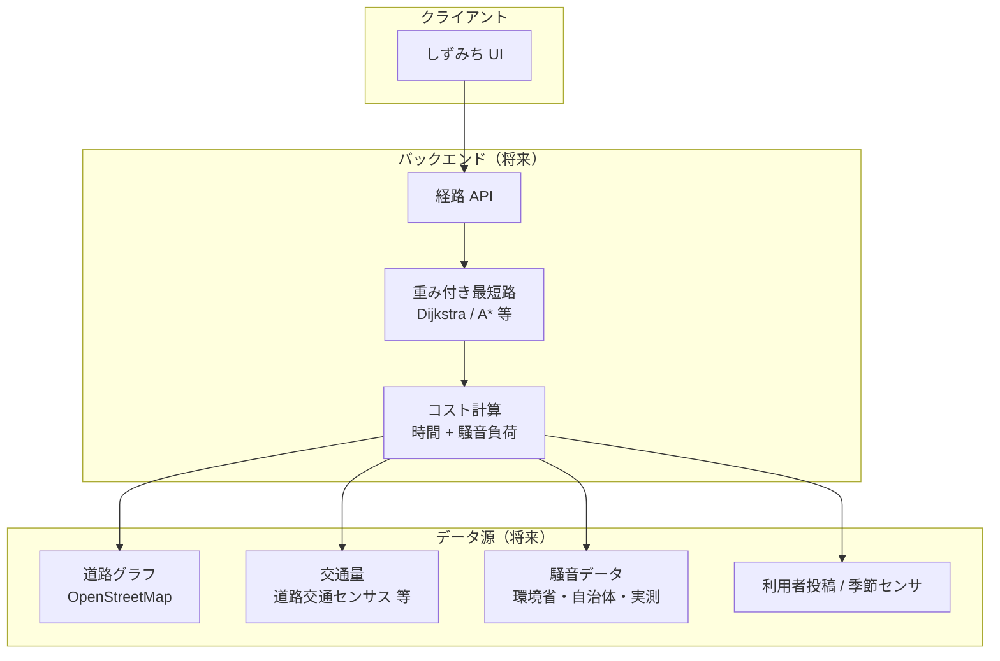

# しずみち

音との距離を選べるルート案内（授業発表動画向けプロトタイプ）

聴覚過敏があり、とくに夏の蝉の音を避けたい利用者が、自宅から市立ひだまり図書館までの **最短 / バランス / 静音** の3経路を比較できます。

提案検証用の画面です。目的地・経路評価・騒音情報はサンプルデータです。

## 技術

| 層 | 採用 |
|---|---|
| フロントエンド | Next.js（App Router）+ React + TypeScript + Tailwind |
| 地図 | Leaflet + react-leaflet + OpenStreetMap |
| 経路 | 固定のデモデータ（実在道路に沿った座標） |
| 公開 | 静的エクスポート（GitHub Pages向け、APIキー不要） |
| 配布 | PWA（ホーム画面追加。地図タイルはオンラインが必要） |

バックエンド、経路探索API、位置情報、マイクは使いません。

## システム構成図

提案検証用プロトタイプの構成です。経路探索API・騒音API・バックエンドは使っていません。

### 現状（デモ）



### アプリ内部（フロント）



### 画面フェーズ



### 公開フロー（Actions なし）



### 将来像（参考）

本格化するときのイメージです。現状のコードには含まれません。



## セットアップ

```bash
cd D:\shizumichi
npm install
npm run dev
```

http://localhost:3000 を開きます。撮影用デモは http://localhost:3000/?demo=1 です。

## GitHub Pages で公開する

Actions は使いません。`main` ブランチの `/docs` フォルダを公開します。

```bash
npm run build:pages
```

できた `docs/` をコミットして `main` にプッシュしたあと、リポジトリの **Settings → Pages** で次を選びます。

- Source: Deploy from a branch
- Branch: `main`
- Folder: `/docs`

公開後のアプリはここです。

- アプリ: https://2ufkpfb9daxnik.github.io/shizumichi/
- 撮影用デモ: https://2ufkpfb9daxnik.github.io/shizumichi/?demo=1

`(root)` だと README が表示されます。`/docs` を選んでください。フォルダがまだ無いと GitHub がエラーを出します。

Service Worker は本番ビルド（GitHub Pages）でのみ登録します。

## ホーム画面に追加（PWA）

GitHub Pages は HTTPS のため、公開後はインストールできます。地図タイル（OpenStreetMap）はオンラインが必要です。

| 環境 | 手順 |
|---|---|
| Android（Chrome） | メニュー → 「アプリをインストール」または「ホーム画面に追加」 |
| iPhone / iPad（Safari） | 共有 → 「ホーム画面に追加」 |

## デモの舞台

地図は東京都杉並区・蚕糸の森公園周辺の実在道路を使っています。

- 自宅・市立ひだまり図書館は架空のデモ地点です
- 最短：公園沿い
- バランス：環七通り・青梅街道側
- 静音：住宅街側

## 撮影用ショートカット（?demo=1）

入力欄にフォーカスしているときは無効です。

| キー | 動作 |
|---|---|
| 1 | 最短 |
| 2 | バランス |
| 3 | 静音 |
| Enter | 検索 / 案内開始 |
| R | 初期状態へ戻る |
| F | 今後の機能 |
| Escape | モーダルを閉じる |
